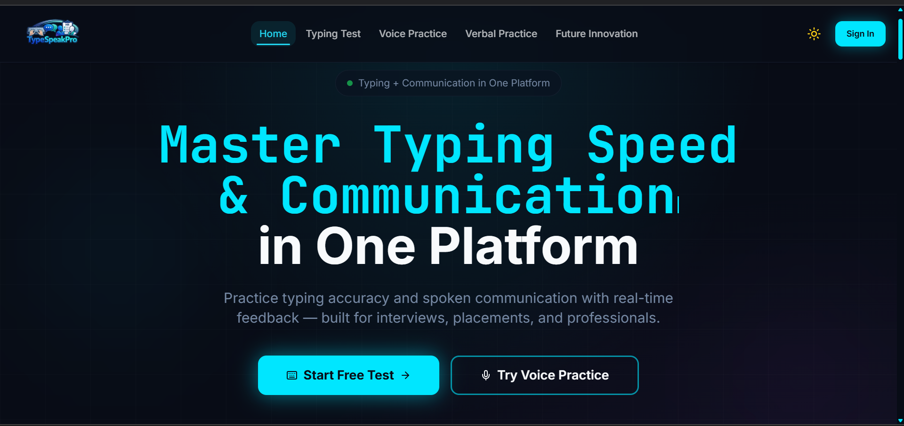
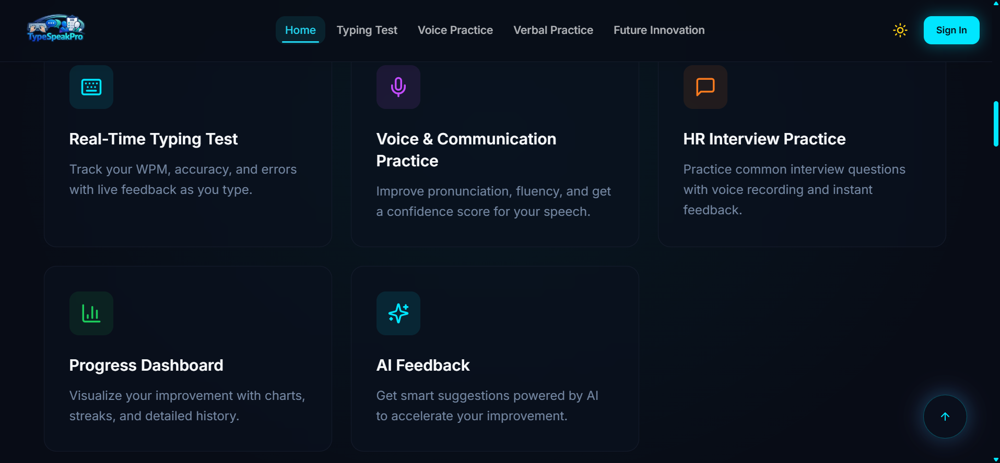
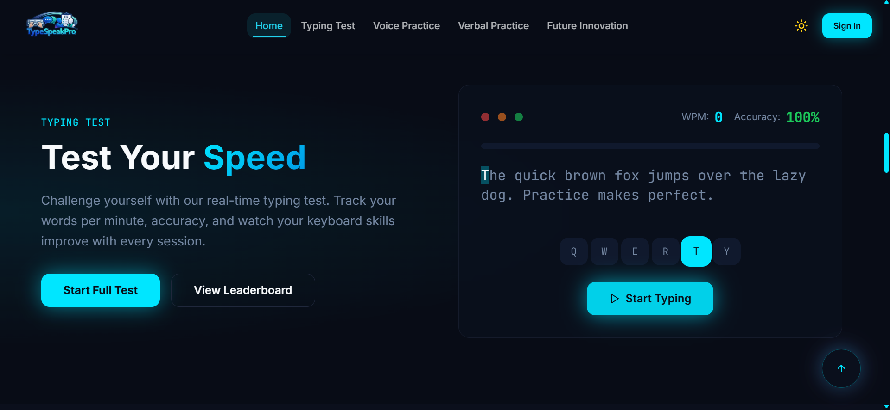
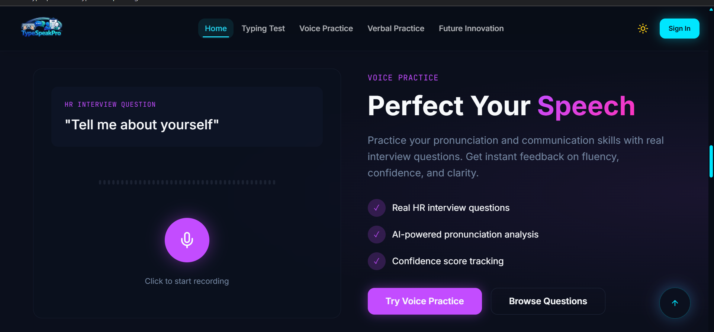
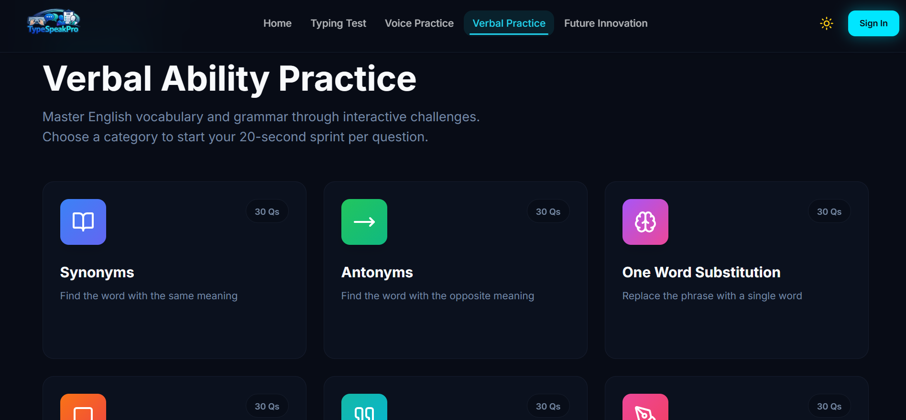
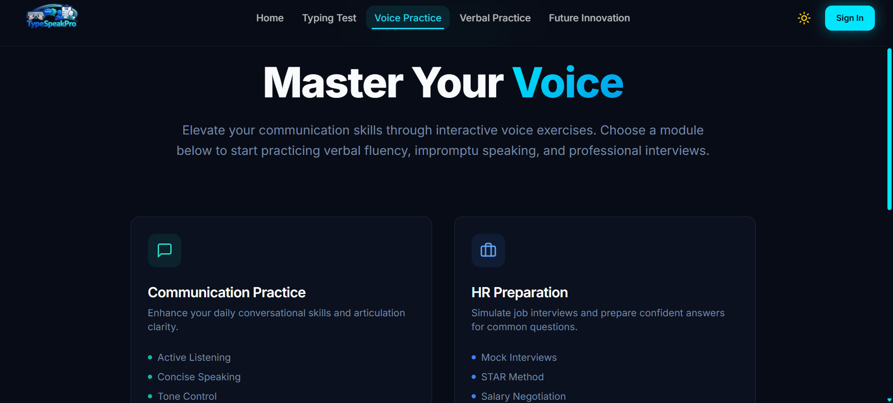

# TypeSpeak Pro 🚀
### The World's First Dual-Engine Communication Trainer.

[](https://github.com/SufalBasak)


---

## 🌐 Live Demo

Experience TypeSpeak Pro live here:

🔗 [Launch TypeSpeak Pro](https://type-speak-pro.vercel.app/)

---

## 💡 The Vision
**This is not just another typing test.**

Most platforms stop at keyboard proficiency. **TypeSpeak Pro** goes further, recognizing that modern communication is a dual discipline: **written speed** and **spoken clarity**.

I built this platform to be the ultimate training ground for both. It merges high-velocity typing challenges with **advanced verbal practice scenarios**, helping you master the art of articulate speech. Whether it's nailing a job interview or commanding a room, TypeSpeak Pro processes your vocal patterns in real-time to build confidence, reduce filler words, and refine your delivery.

It is a completely original architecture designed to train the modern professional's full communication stack—synchronizing *thought*, *speech*, and *action*.

**-- Sufal Basak**

---

## ⚡ Key Innovations

### 1. Dual-Engine Architecture
Unlike standard apps that use simple CRUD operations, TypeSpeak Pro runs two parallel processing engines:
*   **The Reflex Engine**: A low-latency typing core that tracks millisecond-level keystroke dynamics to analyze rhythm and cognitive load.
*   **The Vocal Engine**: A real-time audio analysis pipeline that processes speech patterns for clarity, pacing, and sentiment.

### 2. Custom AI Adversaries
I didn't want generic bots. I built **Adaptive AI Opponents** from scratch:
*   **SpeedDemon**: Algorithms designed to mimic burst-typing patterns of competitive gamers.
*   **TechTitan**: A steady-state efficient typer calibrated to emulate professional coding speeds.
*   *The AI adapts in real-time to challenge, but not overwhelm, the user.*

### 3. The "Prime" Roadmap
On **Feb 14, 2026**, I will be unveiling the **Prime Version**—introducing a proprietary "Sentiment-First" algorithm that judges not just *what* you say, but *how* you say it during high-pressure simulations.

---

## 🛠️ Technical Architecture

This project showcases advanced full-stack engineering capabilities:

*   **Real-Time Synchronization**: Leveraging **Supabase Realtime** for sub-100ms latency in multiplayer races.
*   **Performance Optimization**: Built on **React + Vite** with aggressive code-splitting and memoization to ensure 60FPS animations even during heavy audio processing.
*   **Modern UI/UX**: A custom adaptation of **Tailwind CSS** and **Shadcn/UI**, featuring glassmorphism and dynamic lighting effects inspired by top-tier SaaS interfaces.
*   **Type Safety**: 100% **TypeScript** codebase for enterprise-grade reliability and maintainability.

---

## 📸 Feature Screenshots

### 🏠 Homepage


### ✨ Features Overview


### ⌨️ Typing Practice


### 🎤 Voice Practice


### 🧠 Verbal Ability


### 💼 Interview Preparation


## 🚀 Getting Started

Want to run this innovation locally?

1.  **Clone the repository**
    ```bash
    git clone https://github.com/SufalBasak/TypeSpeakPro.git
    ```

2.  **Install dependencies**
    ```bash
    npm install
    ```

3.  **Run the core**
    ```bash
    npm run dev
    ```

---

## 👤 Author

**Sufal Basak**
*Full Stack Developer & Product Engineer*

*   **GitHub**: [@SufalBasak](https://github.com/SufalBasak)
*   **Email**: [Reach Out](mailto:sufalbasak199@gmail.com)

*Creating the future of communication, one keystroke at a time.*
